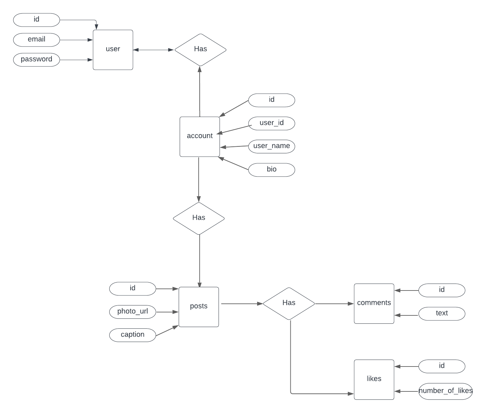

# Only Pets

|       |                                                                                                                                                                                                     |
| ----- | --------------------------------------------------------------------------------------------------------------------------------------------------------------------------------------------------- |
| About | An social media app that allows user to upload photos of pets and look at other pets                                                                            |
| Author  | [Louisa Goncharenko](https://github.com/lougoncharenko) |
| Goal  | Build a robust full-stack application using python and SqlAlchemy                                                                                            |
|       |                                                                                                                                                                                                     |


## Installation and Running App 

To install dependencies, run:

```
pip3 install -r requirements.txt
```

To run the server:

```
python3 app.py
```


## Technologies used
- [python](https://www.python.org)
- [Flask](https://flask.palletsprojects.com/en/2.2.x/)
- [SqlAlchemy](https://www.sqlalchemy.org)


## ERD Chart
<div align="center">



</div>
